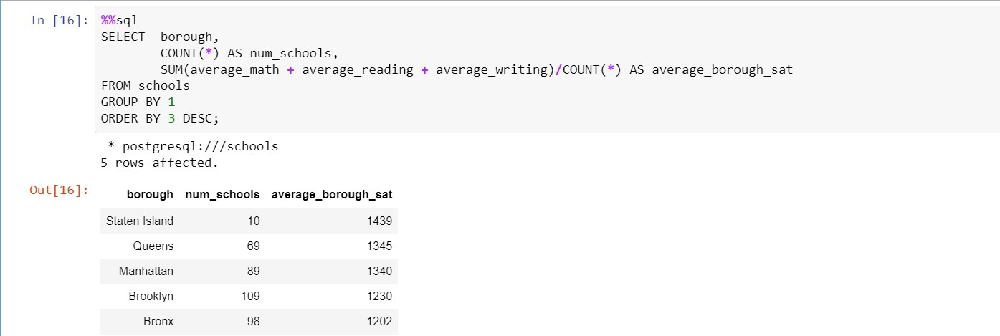
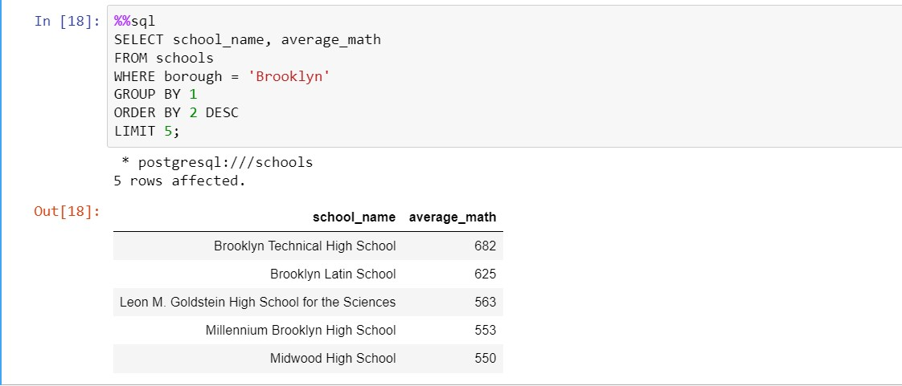

# Analyzing NYC Public School Test Result Scores

___
## Introduction
Every year, school test results play a role in deciding the fate of millions of students. In America, the SAT is a major part of the college admissions process.

In this project, I worked with a SQL database containing test performance from NYC's public schools.

I looked at how performance varies by borough, identified how many schools fail to report information, and presented the top ten performing schools across the city!

### 1) Inspecting the data
Let's familiarize ourselves with the data by taking a looking at the first few schools!

### 2) Finding missing values
It looks like the first school in our database had no data in the percent_tested column!

I identified how many schools have missing data for this column, indicating schools that did not report the percentage of students tested.

To understand whether this missing data problem is widespread in New York, we will also calculate the total number of schools in the database.

### 3) Schools by building code
There are 20 schools with missing data for percent_tested, which only makes up 5% of all rows in the database.

Now let's turn our attention to how many schools there are. When we displayed the first ten rows of the database, several had the same value in the building_code column, suggesting there are multiple schools based in the same location. Let's find out how many unique school locations exist in our database.

### 4) Best schools for math
Out of 375 schools, only 233 (62%) have a unique building_code!

Now let's start our analysis of school performance. As each school reports individually, we will treat them this way rather than grouping them by building_code.

First, let's find all schools with an average math score of at least 80% (out of 800).

### 5) Lowest reading score
Wow, there are only ten public schools in New York City with an average math score of at least 640!

Now let's look at the other end of the spectrum and find the single lowest score for reading. We will only select the score, not the school, to avoid naming and shaming!

### 6) Best writing school
The lowest average score for reading across schools in New York City is less than 40% of the total available points!

Now let's find the school with the highest average writing score.

### 7) Top 10 schools
An average writing score of 693 is pretty impressive!

This top writing score was at the same school that got the top math score, Stuyvesant High School. Stuyvesant is widely known as a perennial top school in New York.

What other schools are also excellent across the board? Let's look at scores across reading, writing, and math to find out.

### 8) Ranking boroughs
There are four schools with average SAT scores of over 2000! Now let's analyze performance by New York City borough.

We will build a query that calculates the number of schools and the average SAT score per borough!

### 9) Brooklyn numbers
It appears that schools in Staten Island, on average, produce higher scores across all three categories. However, there are only 10 schools in Staten Island, compared to an average of 91 schools in the other four boroughs!

For our final query of the database, let's focus on Brooklyn, which has 109 schools. We wish to find the top five schools for math performance.

## Conclusion

In this project, I analyzed SAT performance data from New York City's public schools using SQL. My findings revealed variations in performance across boroughs, identified schools with missing data, and highlighted the top ten performing schools citywide. 

This analysis offers insights into educational disparities and provides valuable information for improving student outcomes and promoting educational equity.
